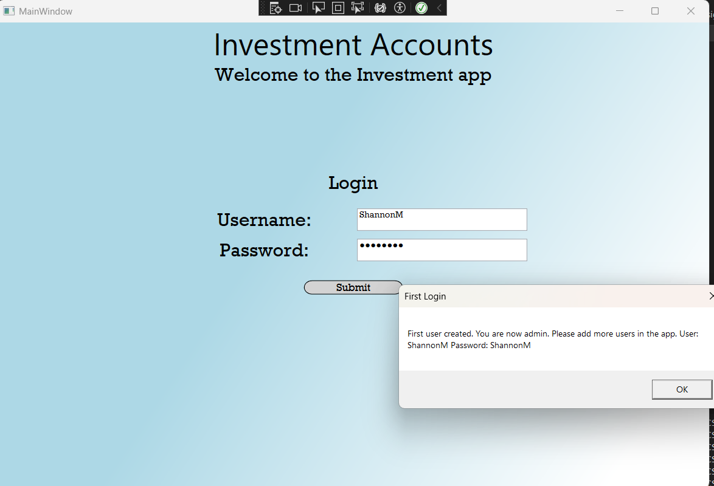
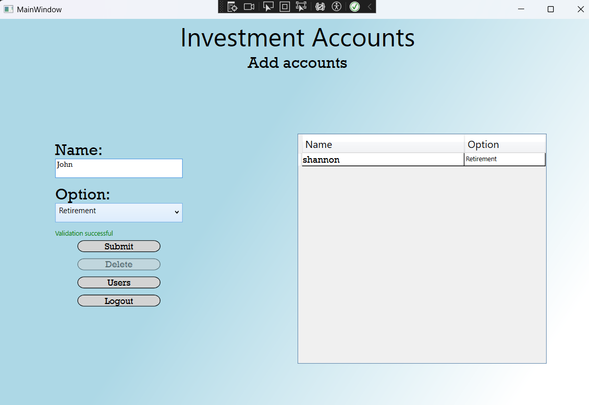
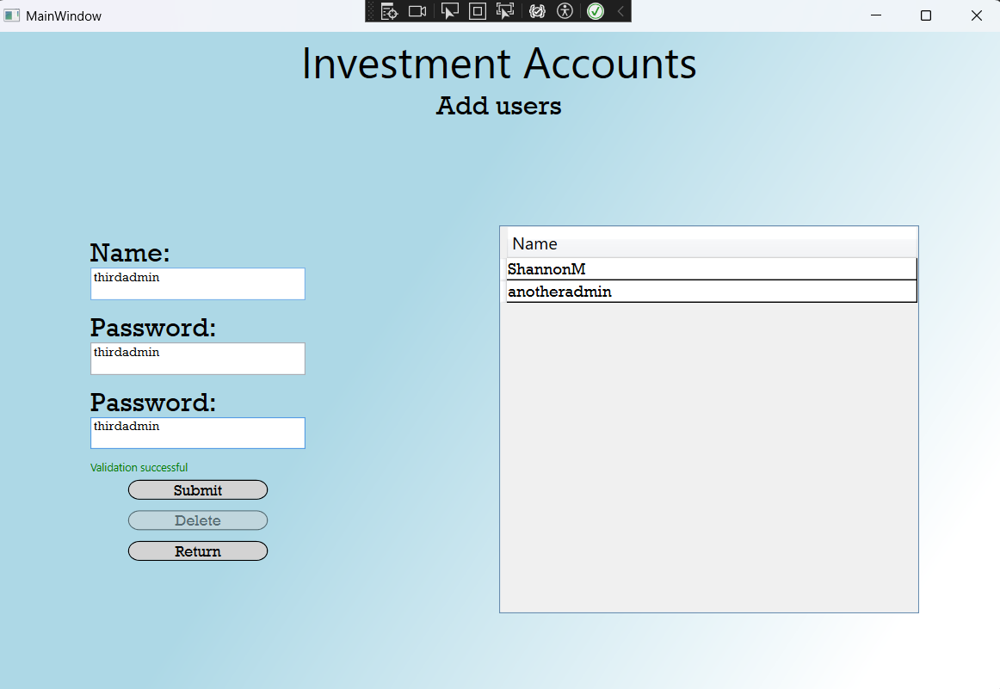
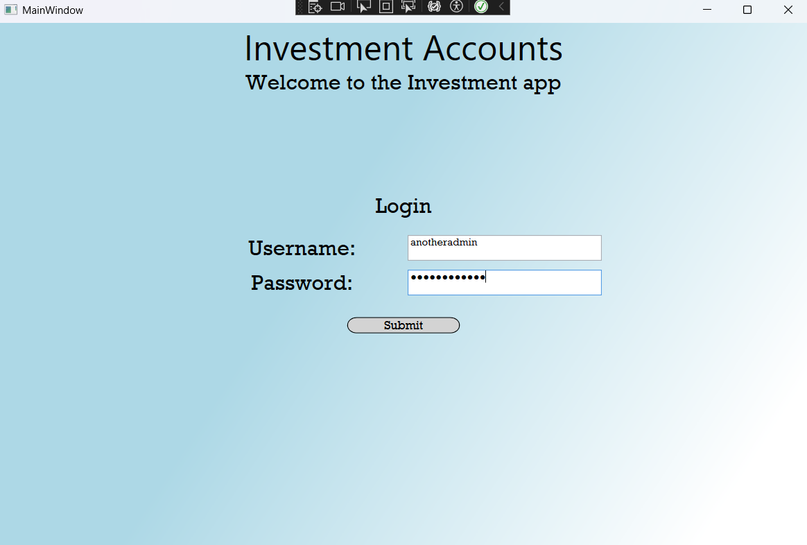

#CS 410 README

About the Project/Project Title
CS410 Investment Accounts is a C# WPF application designed to manage investment accounts for a firm. It provides a secure login system, allows users to create and delete investment accounts, and enables administrators to manage user accounts. The application uses the MVVM pattern to separate concerns, with data persistence handled through file serialization.

Motivation
Managing investment accounts requires secure user authentication and efficient account tracking. Manual processes are prone to errors and inefficiencies, especially when handling multiple account types and user permissions. This application streamlines account management by providing a user-friendly interface for creating, viewing, and deleting accounts, with admin capabilities for user management, ensuring data integrity and security through hashed passwords and validation.

Getting Started
To get started, follow the steps below:
Install Visual Studio with .NET Framework support (see Installation).

Clone or download the project files.

Open the solution in Visual Studio and build the project.

Run the application to access the login screen.

Use the interactive interface to:
Log in with a username and password (first login creates an admin user).

Create or delete investment accounts (e.g., Brokerage, Retirement).

If admin, access the Users view to add or remove non-admin users.

Data is automatically saved to disk upon account or user changes.

Installation
To set up the environment:
Install Visual Studio Community (or higher) with .NET Framework 4.8 or later from Visual Studio Downloads.

Ensure the .NET Framework includes WPF support for XAML-based applications.

Download or clone the project files to a local directory.

Open the .sln file in Visual Studio and build the solution using:
Build > Build Solution.

No external database is required; data is serialized to files in the application directory (handled by FileSaver class).

Usage
The CS410 Investment Accounts application supports the following use cases:
Login: Validates user credentials (username and password) against stored data. The first login creates an admin user.

Manage Accounts: Users can create investment accounts with a name and type (e.g., Brokerage, Retirement) and delete existing accounts.

Manage Users (Admin Only): Admins can add or remove non-admin users, ensuring secure access control.

These users can now log in without admin control.

Data Persistence: Account and user data are serialized to disk automatically upon changes.

Code Example
Example A: Create an Account
The AccountsViewModel handles account creation via the Submit button. Example usage:
csharp

AccountModel mod = new(Model.NameText, Model.OptionEnum);
bool exists = Model.Models.Any(x => x.Equals(mod));
if (!exists)
{
    Model.Models.Add(mod);
    Model.NameText = string.Empty;
}

This creates a new AccountModel with a name and option, checks for uniqueness, and adds it to the ObservableCollection, triggering serialization.

Example B: Read Accounts
The AccountsView displays all accounts in a DataGrid, bound to AccountsModel.Models. Example binding in AccountsView.xaml:
xaml

<DataGrid x:Name="mydatagrid" ItemsSource="{Binding Model.Models}" />

This displays all accounts with their names and types.

Example C: Update Accounts
The application supports updating account types via the DataGrid. Changes trigger the PropChanged event in AccountModel, saving to disk:
csharp

public Option Option
{
    get { return option; }
    set { option = value; PropChanged?.Invoke(this, new EventArgs()); }
}

Example D: Delete Accounts
The DeleteCommand in AccountsViewModel removes a selected account:
csharp

Model.Models.Remove(Model.SelectedItem);

This removes the account from the ObservableCollection, triggering serialization.

Tests

The application includes validation and testing capabilities:
Login Validation: The LoginModels.ValidateLogin method checks for valid username/password pairs and creates an admin user on first login.

Account Validation: The AccountsModel.Validate method ensures account names are 4–20 characters, contain only letters and spaces, and are unique.

User Validation: The UsersModel.Validate method ensures usernames are unique, passwords match, and contain only letters and numbers.

Data Persistence: Test by creating an account, closing the app, and verifying the account persists on restart.

To test:
Run the app and log in with a new username/password to create an admin user.

Create an account with a valid name and type (e.g., Brokerage).

Verify the account appears in the DataGrid.

As admin, navigate to the Users view and add a non-admin user.

Log out, log in with the new user, and confirm restricted access (no Users view).

Check files in the application directory to confirm data persistence.

Contact
Shannon Musgrave
shannon.musgrave@snhu.edu (mailto:shannon.musgrave@snhu.edu)

